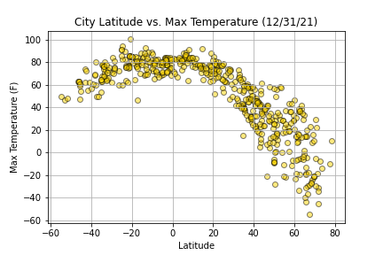
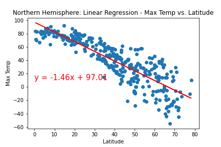
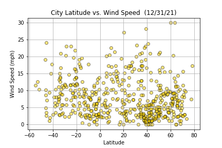
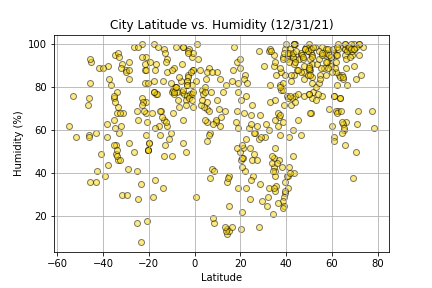
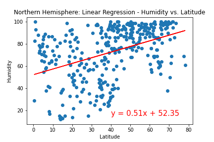
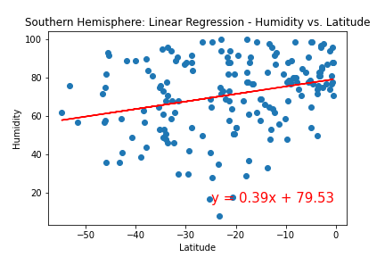

# python-api-challenge
Objective is to build a representative model of Weather across world cities using Python and OpenWeatherMap API.

---

## WeatherPy Analysis

Analysis has been performed on the cities randomly selected from across the world using citiPy. Farmost Cities from equator in the Northern Hemisphere included Longyearbyen, Svalbard, Norway and Qaanaaq, Greenland; and in the Southern Hemisphere were Ushuaia, Argentina (Southernmost tip of South America) and Punta Arenas, Chile.

Equator is at 0 Degrees Latitude. Positive latitudes are considered to be Northern Hemisphere and Negative ones are considered as Southern Hemisphere.

Analysis across Latitudes based on different weather indicators
- `Maximum Temperatures`: During this time of the year, Max temperatures seems to be higher/warmer near the equator. While moving from equator, Max temperatures seem to be reducing and are lesser and colder in the Northern Hemisphere; Southern Hemisphere seems to be still warmer than the northern region.

    

- `Wind Speed`: There does not seem to be any kind of different trends with respect to Windspeeds across the world cities. World scatter plot shows the markers all over with one or two outliers with max speeds reaching 30mph at the far end of Northern Hemisphere.

    

- `Cloudiness`: Similar to Windspeeds, there does not seem to be any specific trend of cloudiness near Equator or in Northern Hemisphere or in Southern Hemisphere. We can see the cloudiness is reaching max level of 100 and min level of 0 across many cities through the regions.

    

- `Humidity`: We can see that the Northern Hemisphere seems to be little more Humid than the regions around Equator and Southern Hemisphere. But the Humid trends are there across the globe with more cities in Northern Hemisphere.

    

---

## VacationPy Analysis

Analysis was performed on the Cities identified from WeatherPy analysis. Considered the ideal weather conditions for the city as below:
1. Max Temperature between 70 Degree Fahrenheit and 80 F
2. Wind Speed less than 10mph
3. Cloudiness is 0%

Identified 12 Cities across the world for future vacations during this time of the year. This analysis also suggests a Hotel for Lodging in the city.

